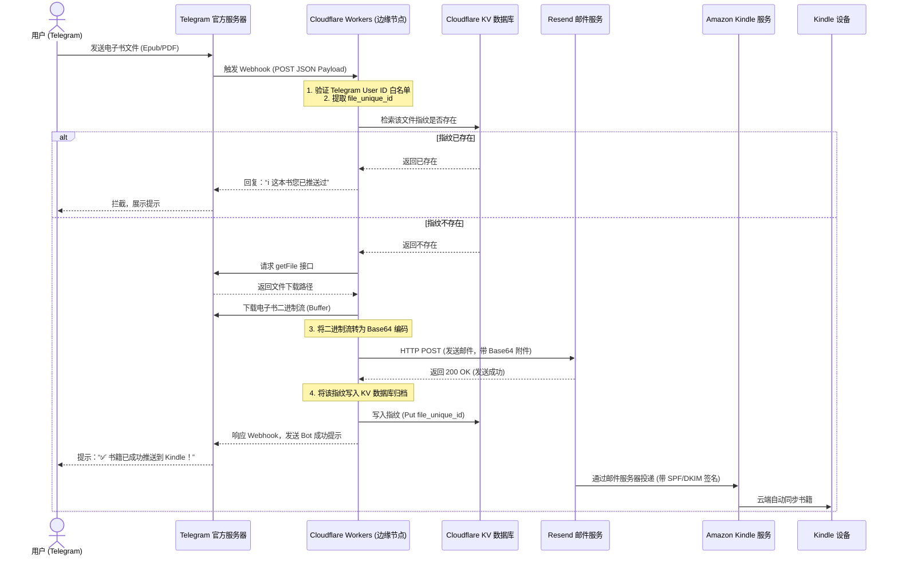

# tg-to-kindle-worker

> 📚 **基于 Cloudflare Workers + Resend API 的 Telegram 电子书自动推送 Kindle 系统 (集成 CF KV 全局文件指纹去重)**

这是一个完全基于 **Serverless 架构** 的高信誉、零服务器成本电子书推送系统。只要将书籍（以 `.epub`、`.pdf` 等格式为主）发送给您的专属 Telegram Bot，它就会在数秒内自动下载、查重并推送到您的 Kindle 设备中。

---

## 🌟 核心硬核特性

1. **⚡️ 极致 Serverless 架构**：完全运行在 Cloudflare 全球边缘计算节点（Workers）上，秒级唤醒，**零物理服务器维护成本，零电费，24小时在线**。
2. **🛡️ Allowed User ID 安全白名单**：内置 Telegram 发送者 User ID 安全校验防线，未授权用户向 Bot 发书将被直接拦截，**绝对保障您的发信额度不被盗刷**。
3. **💾 CF KV 全局文件指纹去重**：集成 Cloudflare KV 分布式数据库。Bot 会自动提取 Telegram 文件的全局唯一指纹（`file_unique_id`），若重复发送已推送过的图书，Bot 会智能拦截并友好提示，**彻底防范 Kindle 端图书堆积并节省发信额度**。
4. **📧 100% 成功的高信誉发信通道**：抛弃了极易被亚马逊判定为垃圾邮件的传统 SMTP 邮箱（如 QQ/163 邮箱），引导您使用托管于 Cloudflare 的自定义域名绑定 **Resend 邮件网关**。通过完美的 **SPF 与 DKIM** 加密数字签名，确保推书成功率接近 **100%**！
5. **⚠️ 20MB 大文件智能防御拦截**：自动拦截超过 Telegram 普通 Bot 下载上限（20MB）的超大文件，保护边缘端 128MB 运行内存，提供人性化中文报错回执，确保系统极强韧性。
6. **🔄 双向退信闭环路由**：结合 Cloudflare Email Routing 的 `Catch-All` 邮件路由转发，亚马逊 Kindle 端的任何退信或回执都会秒级转发至您的个人 Gmail/QQ 邮箱，实现零成本完美的“收发闭环”。

---

## 🛠️ 整体架构与运行序列图

系统的整体控制与数据流转脉络如下：



---

## 🚀 极速部署指南 (只需 4 步)

### 1. 准备发信域名与 API Key
1. 注册并登录 [Resend 官网 (resend.com)](https://resend.com)。
2. 在 **Domains** 页面添加您的自定义域名（如 `yourdomain.com`，建议托管在 Cloudflare 上）。
3. 按照 Resend 提示，在 Cloudflare DNS 记录中添加 **1 条 TXT 记录**（用于配置高可信度的 DKIM 签名前缀 `resend._domainkey`）。
4. 在 Resend 中点击 **Verify** 变绿激活。然后进入 **API Keys** 页面生成您的 API Key（类似于 `re_123456...`）。
5. 登录您的亚马逊账户，在“管理您的内容和设备” -> “首选项” -> “个人文档设置”中，将您的发件邮箱（例如 `kindle@yourdomain.com`）添加到 **“已认可的发件人电子邮箱列表”** 中。

### 2. 本地初始化与编译
克隆本项目至本地，并在项目目录下执行依赖安装与 TypeScript 静态编译检查：
```bash
npm install
npm run build
```

### 3. 创建并绑定 KV 查重数据库
在终端运行以下命令，为您的 Worker 创建免费的查重数据库：
```bash
npx wrangler kv:namespace create KINDLE_BOT_KV
```
运行后，终端会打印出一段配置。请直接将打印出的 `[[kv_namespaces]]` 代码段复制粘贴到您项目目录下的 **`wrangler.toml`** 文件最末尾保存：
```toml
[[kv_namespaces]]
binding = "KINDLE_BOT_KV"
id = "您的 KV 空间 ID"
```

### 4. 部署至 Cloudflare 边缘端并绑定密钥
1. 执行一键云端发布：
   ```bash
   npx wrangler deploy
   ```
   *部署成功后，终端会打印出您的 Worker URL（例如：`https://tg-to-kindle-worker.xxx.workers.dev`），请记录此 URL。*

2. 依次在终端运行以下 5 条命令，以加密 Secrets 的安全形式写入您的敏感密钥（交互式输入，无需带双引号）：
   ```bash
   # 您的 Telegram Bot Token (从 @BotFather 申请)
   npx wrangler secret put TELEGRAM_BOT_TOKEN
   
   # 允许使用此 Bot 的 TG 用户 ID (多个用英文逗号分隔，如 "123456,876543")
   npx wrangler secret put ALLOWED_USER_IDS
   
   # 您的 Resend API Key
   npx wrangler secret put RESEND_API_KEY
   
   # 亚马逊认可的您的专属自定义发信邮箱 (如 kindle@yourdomain.com)
   npx wrangler secret put FROM_EMAIL
   
   # 您的 Kindle 接收邮箱 (如 xxx@kindle.com 或 xxx@sendtokindle.com)
   npx wrangler secret put KINDLE_EMAIL
   ```

3. **激活 Webhook 监听**：
   在浏览器中访问以下网址（将占位符替换为您的真实 Token 和 Worker 部署 URL），激活 Telegram 的实时消息监听：
   ```text
   https://api.telegram.org/bot<TELEGRAM_BOT_TOKEN>/setWebhook?url=<YOUR_WORKER_URL>
   ```
   *若网页返回 `{"ok":true,"result":true,"description":"Webhook was set"}`，说明整套系统已完美对接，开始享受您的推书之旅吧！*

---

## 📜 许可证

本项目基于 [MIT License](LICENSE) 协议开源。
